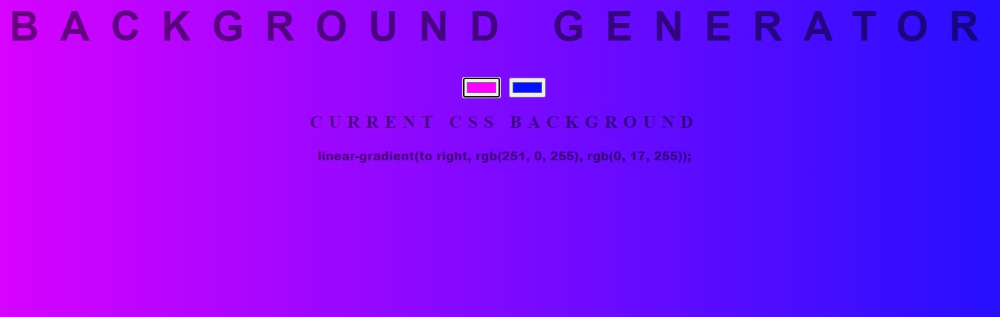
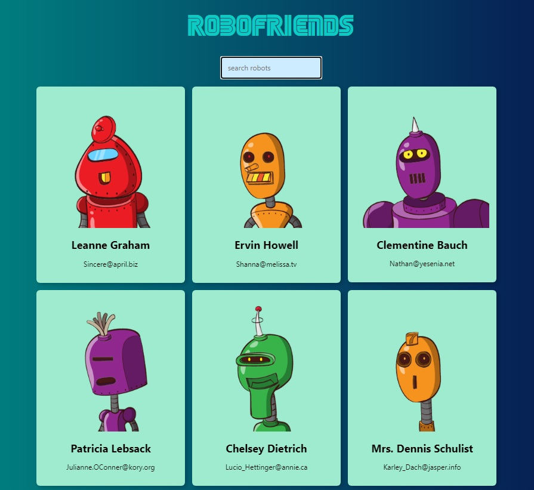
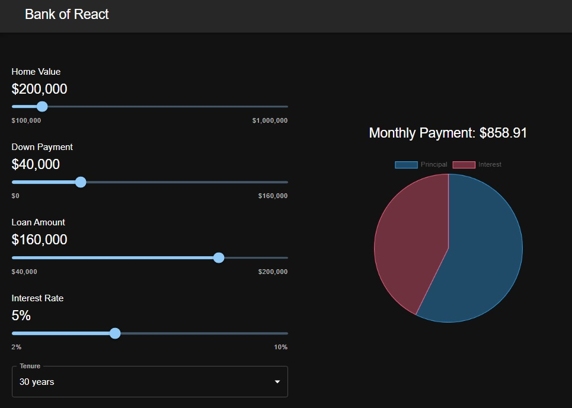

# Course-Projects

Projects from online courses.

## [bg-generator](./projects/bg-generator/)

Simple CSS background generator with color gradient.  
This was from the [`Complete Web Developer Zero to Mastery`](https://www.udemy.com/course/the-complete-web-developer-zero-to-mastery/) course hosted by Udemy.



### Run

Open the `index.html` file to view in the browser.

---

## [robofriends](./projects/robofriends/)

A website written in React displaying robots and their contact information. Enter a search and the robots will be filtered in real time.  
This was from the [`Complete Web Developer Zero to Mastery`](https://www.udemy.com/course/the-complete-web-developer-zero-to-mastery/) course hosted by Udemy.



### Install

You must have `node` and `npm` installed on your machine.  
In your terminal, navigate to the `robofriends` directory, and enter the following command:
```bash
npm install react react-dom
```  

### Run

`npm start` runs the app in the development mode.<br />
Open [http://localhost:3000](http://localhost:3000) to view it in the browser.

---

## [mortgage-calculator](./projects/mortgage-calculator/)

A website written in React to calculate a monthly mortgage payment based on a home value, down payment, interest rate, and loan term.  
This course was hosted by [freeCodeCamp](https://www.freecodecamp.org/news/react-mortgage-calculator-tutorial-for-beginners/).  



### Install

You must have `node` and `npm` installed on your machine.  
In your terminal, navigate to the `mortgage-calculator` directory, and enter the following command to install React to the project:
```bash
npm install react react-dom
```  
You will also need to install [mui](https://mui.com/) and [react-chartjs-2](https://react-chartjs-2.js.org/):
```bash
npm install @mui/material @emotion/react @emotion/styled
npm install --save chart.js react-chartjs-2
```

### Run

`npm start` runs the app in the development mode.<br />
Open [http://localhost:3000](http://localhost:3000) to view it in the browser.